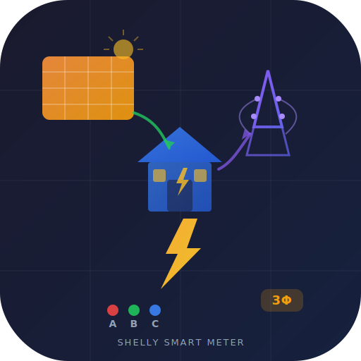

<p align="center">
  
</p>

<h1 align="center">⚡ Shelly Smart Meter Card</h1>

<p align="center">
  Custom Home Assistant card for <strong>Shelly Pro 3EM</strong><br>
  3-phase energy monitoring with solar flow visualization
</p>

<p align="center">
  
  
  
  
</p>

---

## 🔍 Auto-Discovery

The card **automatically detects** any Shelly Pro 3EM integrated in Home Assistant — regardless of the device name! No configuration needed if you have a single Shelly Pro 3EM.

Have multiple? Specify entities manually in the config.

## ✨ Features

| Feature | Description |
|---------|------------|
| ⚡ **Energy Flow** | Animated diagram: Solar → House → Grid with live power values |
| 🔌 **3-Phase Monitor** | Per-phase: voltage, current, active power (W), apparent power (VA), power factor, frequency |
| 📊 **Totals** | Expandable: active/apparent power, current, PF, energy in/out, total cost |
| 📈 **Daily Energy** | Grid import, grid export, house consumption, heat pump consumption |
| 💰 **Cost Tracking** | Daily cost estimation (configurable rate) + lifetime total cost |
| 📡 **Device Status** | Temperature, WiFi RSSI, uptime, cloud/local, restart required, firmware updates |
| 🎮 **Controls** | Reboot button, BLE integration switch, monitor-production.js switch |
| 🏷️ **Phase Labels** | Custom names per phase |
| 🎨 **Visual Editor** | 5-tab config UI (General, Phases, Totals, Energy, Device) |
| 📱 **Responsive** | Adapts to mobile & desktop |
| 🔍 **Auto-Discovery** | Finds any Shelly Pro 3EM automatically by entity pattern |

## 📦 Installation

### HACS (Custom Repository)
1. Go to **HACS → Integrations → ⋮ → Custom repositories**
2. Add URL: `https://github.com/Liionboy/ha-shelly-smart-meter-card`
3. Category: **Frontend**
4. Click **Install**
5. Refresh browser cache

### Manual
1. Download `ha-shelly-smart-meter-card.js` from [releases](../../releases)
2. Copy to `/config/www/`
3. Add resource in **Settings → Dashboards → Resources**:
   ```
   /local/ha-shelly-smart-meter-card.js
   Type: JavaScript Module
   ```

## ⚙️ Configuration

### Minimal (auto-discovery)
```yaml
type: custom:ha-shelly-smart-meter-card
```
Zero config — automatically finds your Shelly Pro 3EM!

### Full
```yaml
type: custom:ha-shelly-smart-meter-card
title: "⚡ Smart Meter Solar"
show_header: true
show_flow: true
show_phases: true
show_totals: true
show_energy: true
show_costs: true
show_device: true
show_controls: true
cost_per_kwh: 0.85
phase_labels:
  A: House
  B: Heat Pump
  C: Stove
entities:
  # Phase A (per-phase sensors)
  phase_a_power: sensor.xxx_phase_a_active_power
  phase_a_apparent: sensor.xxx_phase_a_apparent_power
  phase_a_voltage: sensor.xxx_phase_a_voltage
  phase_a_current: sensor.xxx_phase_a_current
  phase_a_pf: sensor.xxx_phase_a_power_factor
  phase_a_freq: sensor.xxx_phase_a_frequency
  phase_a_energy: sensor.xxx_phase_a_total_active_energy
  phase_a_returned: sensor.xxx_phase_a_total_active_returned_energy
  # Same pattern for phase_b_*, phase_c_*

  # Totals
  total_power: sensor.xxx_total_active_power
  total_apparent: sensor.xxx_total_apparent_power
  total_current: sensor.xxx_total_current
  total_energy: sensor.xxx_total_active_energy
  total_returned: sensor.xxx_total_active_returned_energy
  total_cost: sensor.xxx_total_active_energy_cost

  # Daily (helper entities — manual config required)
  daily_consumed: sensor.daily_house_consumption
  daily_grid: sensor.daily_grid_import
  daily_return: sensor.daily_grid_export
  daily_hp: sensor.daily_heat_pump

  # Device (auto-discovered)
  temperature: sensor.xxx_temperature
  rssi: sensor.xxx_rssi
  uptime: sensor.xxx_uptime
  cloud: binary_sensor.xxx_cloud
  restart_required: binary_sensor.xxx_restart_required
  firmware: update.xxx_firmware_update
  beta_firmware: update.xxx_beta_firmware_update
  device_tracker: device_tracker.xxx

  # Controls (auto-discovered)
  reboot: button.xxx_reboot
  ble_integration: switch.xxx_aioshelly_ble_integration
  monitor_production: switch.xxx_monitor_production_js
```

## 🏷️ Entity Resolution

Entities are resolved in this order:
1. **Manual config** — `entities.xxx` in YAML
2. **Auto-discovery** — searches for `sensor.*_phase_a_active_power` pattern
3. **Empty** — section is hidden if no entity found

### Auto-discovered entities (38 total)

| Section | Keys |
|---------|------|
| **Per Phase (×3)** | `phase_{a,b,c}_power`, `_apparent`, `_voltage`, `_current`, `_pf`, `_freq`, `_energy`, `_returned` |
| **Totals** | `total_power`, `total_apparent`, `total_current`, `total_energy`, `total_returned`, `total_cost` |
| **Device** | `temperature`, `rssi`, `uptime`, `cloud`, `restart_required` |
| **Updates** | `firmware`, `beta_firmware` |
| **Switches** | `ble_integration`, `monitor_production` |
| **Buttons** | `reboot` |
| **Tracker** | `device_tracker` |

### Manual config required (helper entities)

| Key | Description |
|-----|-------------|
| `daily_consumed` | Utility meter — daily house consumption |
| `daily_grid` | Utility meter — daily grid import |
| `daily_return` | Utility meter — daily grid export |
| `daily_hp` | Utility meter — daily heat pump consumption |

## 📸 Screenshots

_Add screenshot here_

## 🛠️ Development

```bash
git clone https://github.com/Liionboy/ha-shelly-smart-meter-card.git
cd ha-shelly-smart-meter-card
npm install
npm run build
```

Output: `dist/ha-shelly-smart-meter-card.js`

## 📄 License

MIT — made with ⚡ for Home Assistant
